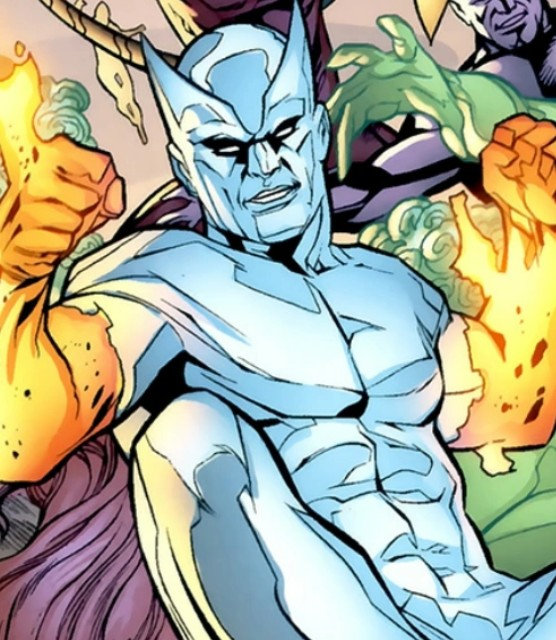

# 🧠 Superschurken des Marvel-Multiversums

Wo Helden das Licht bringen, werfen sie auch lange Schatten.  
Diese Seite ist jenen gewidmet, die das Gleichgewicht stören, Macht an sich reißen oder das Multiversum selbst herausfordern.

Ob wahnsinnige Genies, gefallene Engel oder uralte kosmische Bedrohungen – Marvels Superschurken sind mehr als bloße Gegenspieler.  
Sie sind Visionäre, Fanatiker, Herrscher und Monster … und manchmal sogar Opfer ihrer eigenen Ambitionen.

Lerne die düsteren Figuren kennen, die Geschichte geschrieben haben – von **Doctor Doom**, **Thanos** und **dem Grünen Kobold** bis hin zu **Kang**, **Magneto** und realitätsverändernden Bedrohungen wie dem Symbiontenvater **Knull**, Höllenfürst **Mephisto**, Alptraum-Entität **Nightmare**, dem mysteriösen **Grauen Verbund** oder dem **Imperator**, mit seinen magieverschlingenden **Empirikul**-Horden.

> Ihre Taten hinterlassen Narben – auf Welten, in Herzen und im Gewebe der Realität selbst.

🔙 [Zurück zur Startseite](../index.md)

  <a href="equinox-terrance-sorenson/index.md">
    
     
    ➡️ Mehr über Equinox – Terrance ‘Terry’ Sorenson erfahren
  </a>

